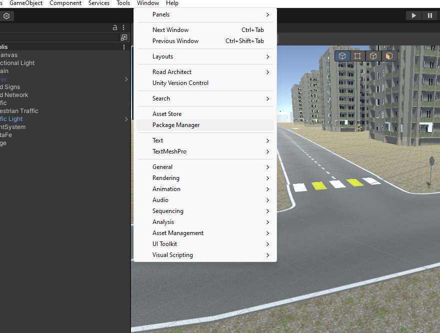
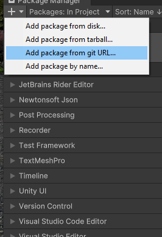

# Unity ProBridge Sensors

Unity ProBridge Sensors is a plugin for [Unity ProBridge](https://github.com/RosProBridge/UnityBridge). It provides Unity implementations of commonly used sensors for ProBridge.

## Available Sensors

- **RGB Camera**
- **IMU**
- **NavSatFix**
- **Lidar**:
  - Velodyne: VLP-16, VLP-16-HiRes, VLP-32, HDL-32E, VLS-128
  - Livox: Avia, Horizon, Mid40, Mid70, Tele, HAP, Mid360

## Installation Guide

### Prerequisites

Before you begin, ensure you have the following:

- Git installed on your computer.
- Unity Editor 2021.3 or later installed and ready to use.
- [UnityProBridge](https://github.com/RosProBridge/UnityBridge) Installed.

### 1. Accessing Package Manager in Unity

Next, you need to open Unity and access the Package Manager:

- Launch Unity and open your project.
- Go to `Window` > `Package Manager` to open the Package Manager window.

### 2. Adding Package from git URL

Within the Package Manager:

- Click the `+` button in the top left corner.
- Select `Add package from git URL...`.
- Add the following link `https://github.com/RosProBridge/UnityBridgeSensors.git`

### 3. Verifying Installation

If the installation process was successful, you should now be able to see `ProBridgeSensors` listed among the installed packages in the Package Manager. This confirms the package is ready for use in your project.

## Documentation

For usage details check the [Documentation](/Documentation/docs.md).